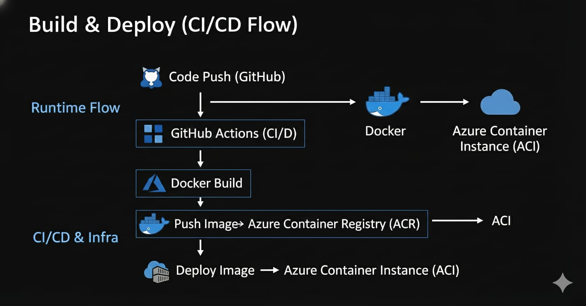
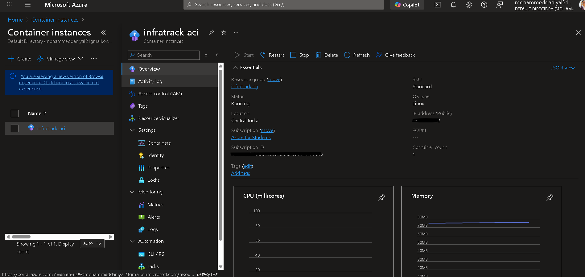
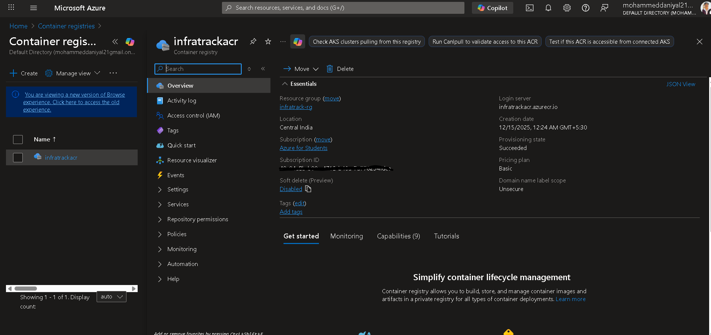
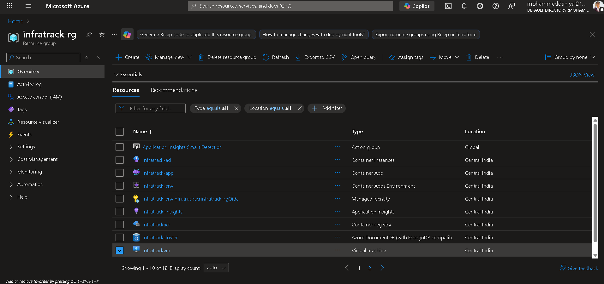
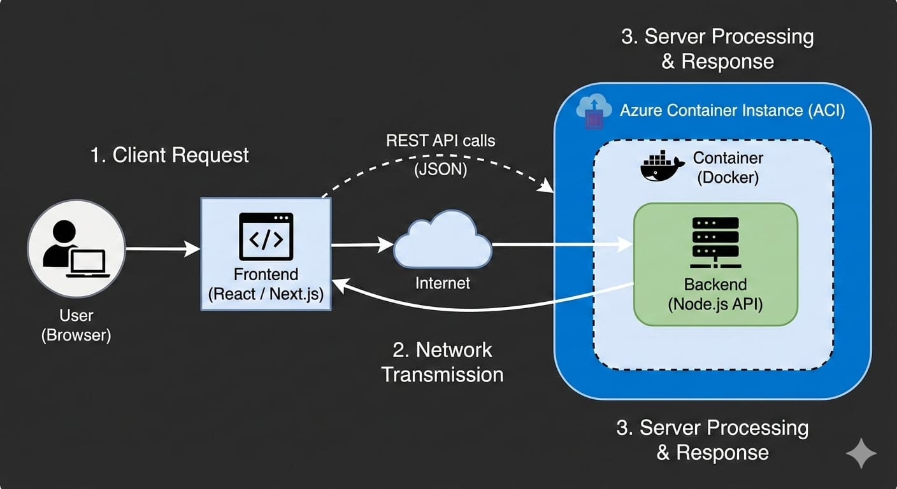

# InfraTrack Platform


<p align="center">
  
</p>

<h3 align="center">
  <a href="https://your-demo-video-link.com" style="text-decoration:none;">
    
  </a>
  &nbsp;
  <a href="frontend/public/media/infratrack_presentation.pptx" style="text-decoration:none;">
    
  </a>
</h3>

InfraTrack is an innovative cloud monitoring and DevOps dashboard for Azure, providing real-time insights into resources, costs, alerts, CI/CD, and user management—all in one modern interface.

## 🚀 Features
- Real-time Azure resource monitoring (VMs, ACI, AKS)
- Cost management and breakdown
- Alerts and log analytics
- CI/CD pipeline monitoring (GitHub Actions)
- User and role management
- Modern, responsive UI (React + Tailwind)

## 🏁 Quickstart
1. Clone the repo
2. Set environment variables (see `.env.example`)
3. Deploy to Azure Container Apps or run locally

---

## 📸 Screenshots
<p align="center">
  
  
  
  
  
  
</p>

---

## 📂 Folder Structure
```
/ (root)
  backend/         # Node.js Express API, Azure integration
  frontend/        # React app (Vite, Tailwind)
  .github/         # GitHub Actions workflows
  Dockerfile       # Multi-stage build for Azure Container Apps
  LICENSE
  README.md
  QUICKSTART.md    # (Optional: quick setup guide)
```
## link https://infratrack-app.graycoast-34d22b0c.centralindia.azurecontainerapps.io/

## 👤 Author
- Mohammed Daniyal

---
For more, see the code or contact the author.

